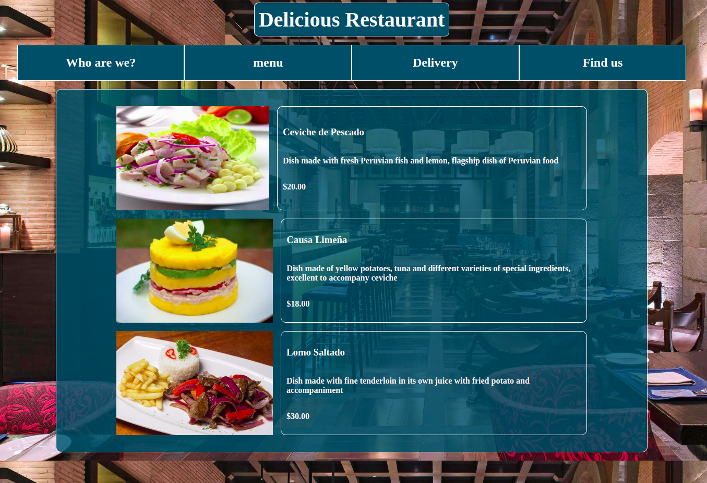

# 🧐 Restaurant-page

## :scroll: Concept

> With this project, you can swap between different tabs and see diferent information about your favorite restaurant, like Who are we?, the menu, delivery information and how to find them.

## :octocat: Usage

- This project intends to practice my skills on JavaScript ES6
## 🛠 Built

- Javascript ES6
- HTML 5
- CSS

## 🔴 Live Demo

[Live Demo](https://rawcdn.githack.com/diazgio/Restaurant-page/feature/rest/dist/index.html)

## 🔧 Getting Started

To get a local copy up and running follow these simple example steps.

### 📝 Prerequisites

- A browser
- Text Editor

### 📝 Setup

**STEP 1**
In the terminal, Run the following commands.

- `git clone https://github.com/diazgio/Library-JS.git`
- `cd Library-JS`

OR

- Download the zip file form `https://github.com/diazgio/Library-JS/tree/development`

**STEP 2**

- Then open the `index.html` file using a browser.
- Enjoy the simple library.

## 👤 Authors

- Github: [@diazgio](https://github.com/diazgio)
- Twitter: [@giordano_diaz](https://twitter.com/giordano_diaz)
- LinkenIn:[giordano-diaz](www.linkedin.com/in/Giordano-Diaz) 

## 🤝 Contributing

Contributions, issues and feature requests are welcome!

Feel free to check the [issues page](https://github.com/diazgio/Restaurant-page/issues).

## :pray: Show your support

Give a ⭐️ if you like this project!

## 📝 License

This project is [MIT](https://opensource.org/licenses/MIT) licensed.